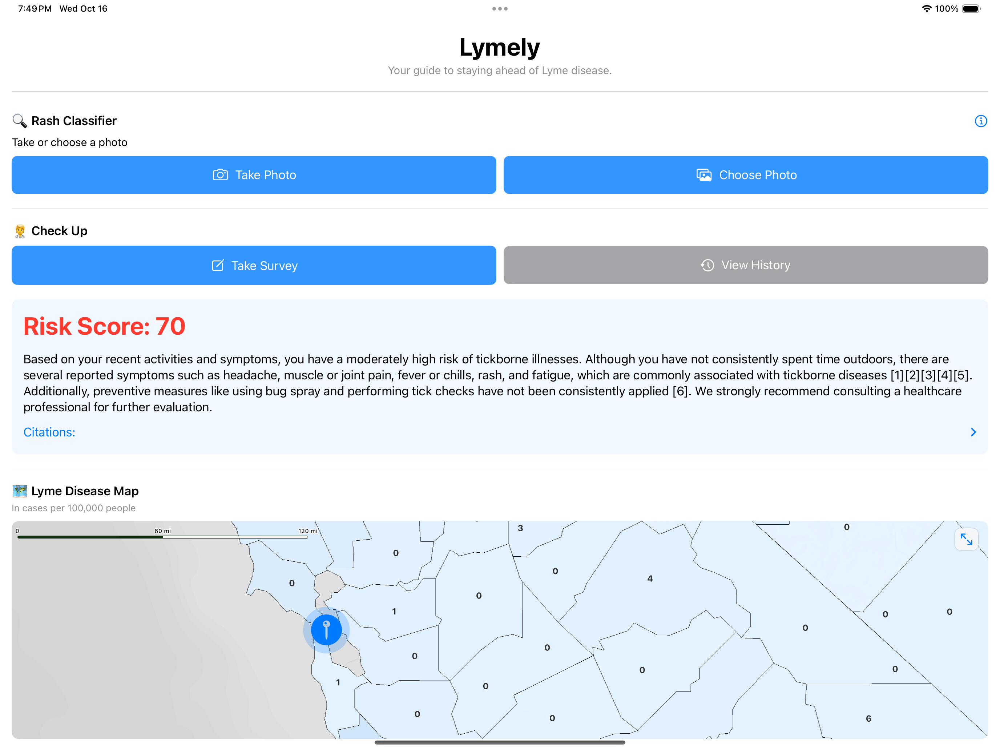

<!-- PROJECT LOGO -->
<br />
<div align="center">
  <a href="https://github.com/elijahrenner/lymely">
    
  </a>

  <h3 align="center">Lymely</h3>

  <p align="center">
    <strong>Your guide to staying ahead of Lyme disease.</strong>
    <br /><br />
    <a href="https://github.com/elijahrenner/lymely" style="text-decoration: none; color: #007BFF;">View Demo</a> &nbsp;|&nbsp;
    <a href="https://github.com/elijahrenner/lymely/blob/main/Lymely.pdf" style="text-decoration: none; color: #007BFF;">Slides</a> &nbsp;|&nbsp;
    <a href="Poster.pdf" style="text-decoration: none; color: #007BFF;">Poster</a>
    <br /><br />
    
  </p>
</div>

<p align="center" style="font-style: italic;">[UPDATED 04/07/2025]: Lymely now supports local inference with <a href="https://github.com/ml-explore/mlx" style="text-decoration: none; color: #007BFF;">MLX</a> for improved user security and affordability.</p>

<div align="center">
  
</div>

<!-- TABLE OF CONTENTS -->
<details>
  <summary>Table of Contents</summary>
  <ol>
    <li><a href="#about-the-project">About The Project</a></li>
    <li><a href="#features">Features</a></li>
    <li><a href="#usage">Usage</a></li>
    <li><a href="#setup">Setup</a></li>
    <li><a href="#codebase-overview">Codebase Overview</a></li>
    <li><a href="#attribution">Attribution</a></li>
  </ol>
</details>

<!-- ABOUT THE PROJECT -->
## About The Project

Lymely is an entry for the 2024 Congressional App Challenge, designed to provide users with tools and resources to manage and understand Lyme disease risks.

<p align="right">(<a href="#readme-top">back to top</a>)</p>

<!-- FEATURES -->
## Features

- **Symptom and Activity Reporting with History** 📋
  - Track symptoms and activities with a detailed history view.

- **Interactive Tick Territory Heat Map** 🗺️
  - Visualize tick territories with an interactive heat map.

- **Lyme Education Resources** 📚
  - Access a wealth of resources to learn more about Lyme disease.

- **Rash Analysis Computer Vision Model** 🔍
  - Analyze rashes using a computer vision model to assess potential Lyme disease risk.

- **Risk Assessment with GPT-4o Agent** ⚠️
  - Utilize a fine-tuned GPT-4o agent to assess Lyme disease risk.

<p align="right">(<a href="#readme-top">back to top</a>)</p>

<!-- USAGE -->
## Usage

Lymely is not yet available on the App Store, but you can still access the app by downloading the source code and running it on your own device.

<p align="right">(<a href="#readme-top">back to top</a>)</p>

<!-- SETUP -->
## Setup

To run Lymely on your local machine, you need to perform the following steps:

1. Clone the repository to your local machine.
2. Open the project in Xcode.
3. Create an `Info.plist` file in the `Lymely/Lymely` directory if it doesn't already exist.
4. Add the following keys to your `Info.plist` file:
   - `OpenAIAPIKey`: Your OpenAI API key
   - `MBXAccessToken`: Your Mapbox access token
5. Ensure you have the following libraries installed and imported in your project:
   - SwiftUI
   - UIKit
   - MapboxMaps
   - CoreLocation
   - Foundation
   - CoreML
   - Vision
   - MapKit
   - MapboxCoreMaps
   - MapboxCommon
   - AVFoundation
   - Combine

You can add these libraries to your project using Swift Package Manager or CocoaPods, depending on your preference.

<p align="right">(<a href="#readme-top">back to top</a>)</p>

<!-- CODEBASE OVERVIEW -->
## Codebase Overview

- **Lymely/Lymely.xcodeproj/project.pbxproj**: The main project file for Xcode, containing the configuration for building the app.
  ```Lymely/Lymely.xcodeproj/project.pbxproj
  startLine: 1
  endLine: 626
  ```

- **Lymely/Lymely/ContentView.swift**: The main view of the app, providing access to various features including rash classification and survey taking.
  ```swift:Lymely/Lymely/ContentView.swift
  startLine: 1
  endLine: 239
  ```

- **Lymely/Lymely/SurveyView.swift**: Manages the survey data collection and risk assessment report generation.
  ```swift:Lymely/Lymely/SurveyView.swift
  startLine: 1
  endLine: 687
  ```

- **Lymely/Lymely/Resources/Map/script.py**: A script for processing geographical data related to Lyme disease.
  ```python:Lymely/Lymely/Resources/Map/script.py
  startLine: 1
  endLine: 20
  ```

- **Lymely/Lymely.xcodeproj/project.xcworkspace/contents.xcworkspacedata**: Contains workspace data for the Xcode project.
  ```Lymely/Lymely.xcodeproj/project.xcworkspace/contents.xcworkspacedata
  startLine: 1
  endLine: 8
  ```

- **Lymely/LymelyUITests/LymelyUITests.swift**: Contains UI tests for the Lymely app.
  ```swift:Lymely/LymelyUITests/LymelyUITests.swift
  startLine: 1
  endLine: 32
  ```

- **Lymely/LymelyTests/LymelyTests.swift**: Contains unit tests for the Lymely app.
  ```swift:Lymely/LymelyTests/LymelyTests.swift
  startLine: 1
  endLine: 17
  ```

<p align="right">(<a href="#readme-top">back to top</a>)</p>

<!-- ACKNOWLEDGMENTS -->
## Acknowledgments

- [Hopkins Lyme Tracker](https://www.hopkinslymetracker.org/explorer) - The data used to create the tick map is from Hopkins' Lyme Tracker.
- [CDC Lyme Disease](https://www.cdc.gov/lyme/about/index.html) - The early Lyme disease symptoms used to educate the Llama 3.2 model are from the CDC.
- [Lyme Disease Erythema Migrans Rashes Dataset](https://www.kaggle.com/datasets/sshikamaru/lyme-disease-rashes) - The dataset used to train the rash classification model, courtesy of Edward Zhang at Dartmouth College.

<!-- ATTRIBUTION -->
## Attribution

```bibtex
@misc{lymely2024,
  author = {Elijah Renner},
  title = {Lymely: An App for Lyme Disease Awareness and 
  Management},
  year = {2024},
  howpublished = {\url{https://github.com/elijahrenner/
  lymely}},
}
```

<p align="right">(<a href="#readme-top">back to top</a>)</p>